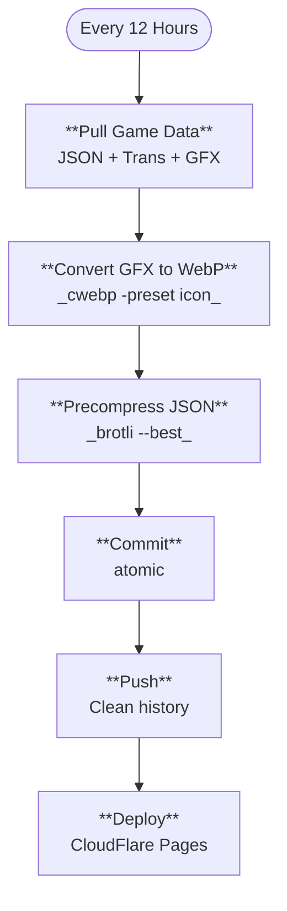
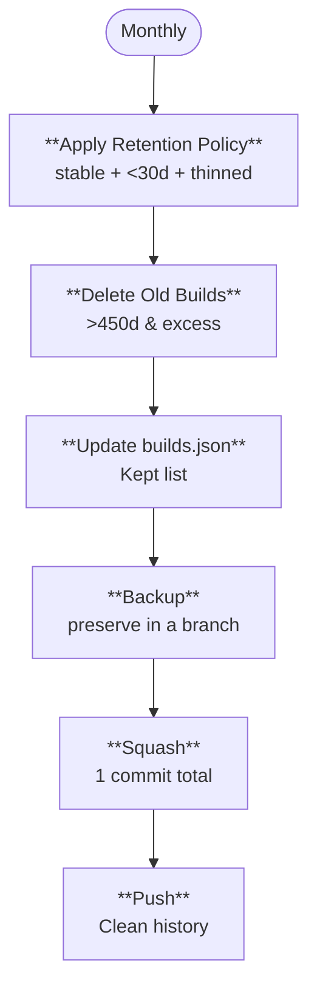

# Cataclysm: BN data

Game data from [Cataclysm: Bright Nights](https://github.com/cataclysmbn/Cataclysm-BN) updated every 12 hours and
deployed at [data.cataclysmbn-guide.com](https://data.cataclysmbn-guide.com/).
Built for [ushkinaz/cbn-guide](https://github.com/ushkinaz/cbn-guide/)

[](https://github.com/ushkinaz/cbn-data/actions/workflows/pull-data.yml)
[](https://github.com/ushkinaz/cbn-data/actions/workflows/prune-data.yml)

## Usage

### Get available versions

```
curl -s https://data.cataclysmbn-guide.com/builds.json
```

### Get game data

```
curl -s https://data.cataclysmbn-guide.com/data/2026-01-10/all.json
```

```
curl -s https://data.cataclysmbn-guide.com/data/2026-01-10/all_mods.json
```

**Structure:**

```json
{
  "build_number": "2026-01-10",
  "release": {},
  "data": [],
  "mods": {}
}
```

### Get translations

```
curl -s https://data.cataclysmbn-guide.com/data/2026-01-10/lang/fr.json
```

```
curl -s https://data.cataclysmbn-guide.com/data/2026-01-10/lang/zh_CN_pinyin.json
```

Format: [Jed-compatible](https://www.npmjs.com/package/po2json), produced with po2json.

### Get tileset graphics

```
curl -s https://data.cataclysmbn-guide.com/data/2026-01-10/gfx/UltimateCataclysm/...
```

All graphics are WebP format. Original PNGs converted during build.

## Performance

All JSON files are stored in the repository as precompressed Brotli streams but retain the standard .json extension.
Cloudflare Pages is configured to serve these files with `Content-Encoding: br`.

While Cloudflare can compress responses on the fly, it typically uses Brotli quality 4 for performance. Precompressing
at quality 11 yields significantly smaller files.

All graphics are converted to WebP format during the build. We use `cwebp -preset icon`, capturing massive savings
without quality loss.

**JSON Compression Comparison:**

| Method           | Size    | Ratio | Notes                         |
|:-----------------|:--------|:------|:------------------------------|
| **Uncompressed** | 18.9 MB | 100%  | Raw JSON size                 |
| **Gzip**         | 2.8 MB  | 15%   | Standard compression          |
| **Brotli (Q4)**  | 2.6 MB  | 14%   | Cloudflare on-the-fly default |
| **Brotli (Q11)** | 2.0 MB  | 10%   | **Stored in repository**      |

**GFX Compression Comparison:**

| Format   | Size    | Ratio | Notes                    |
|:---------|:--------|:------|:-------------------------|
| **PNG**  | 17.8 MB | 100%  | Original tileset size    |
| **WebP** | 5.8 MB  | 33%   | **Stored in repository** |

### Total Network Savings

Comparing the baseline (Gzip JSON + PNG) against the current optimized stack (Brotli Q11 + WebP):

| Stack         | all.json | Tileset | Total       |
|:--------------|:---------|:--------|:------------|
| **Baseline**  | 2.8 MB   | 17.8 MB | **20.6 MB** |
| **Optimized** | 2.0 MB   | 5.8 MB  | **7.8 MB**  |

**Total Reduction: ~62% smaller payloads.**

- **Note:** Raw JSON and PNGs are not stored or served; clients must support Brotli ([99.31%](https://caniuse.com/brotli) globally) and WebP ([99.02%](https://caniuse.com/webp) globally).

## Repository Structure

- `action` branch: CI workflows and scripts
- `main` branch: Published data (deployed)
- `backup` branch: Previous data after pruning, kept for 1 month

## Local Development

```bash
# Clone action branch only
git clone --single-branch https://github.com/ushkinaz/cbn-data

# Install dependencies
pnpm install

# Run data pull (dry-run by default)
node pull-data-launcher.js

# Run with actual writes
GITHUB_TOKEN=xxx node pull-data-launcher.js
```

### Data Pipeline



### Data Pruning



## Data Retention Rules

Monthly pruning keeps:

- All stable releases
- All builds from last 30 days
- Older builds on the thinning schedule (every 2/4/8 days)
- Drops builds older than 450 days

## Contributing

Built for [The Hitchhiker's Guide to Cataclysm: Bright Nights](https://cataclysmbn-guide.com/).

Contributions welcome!
