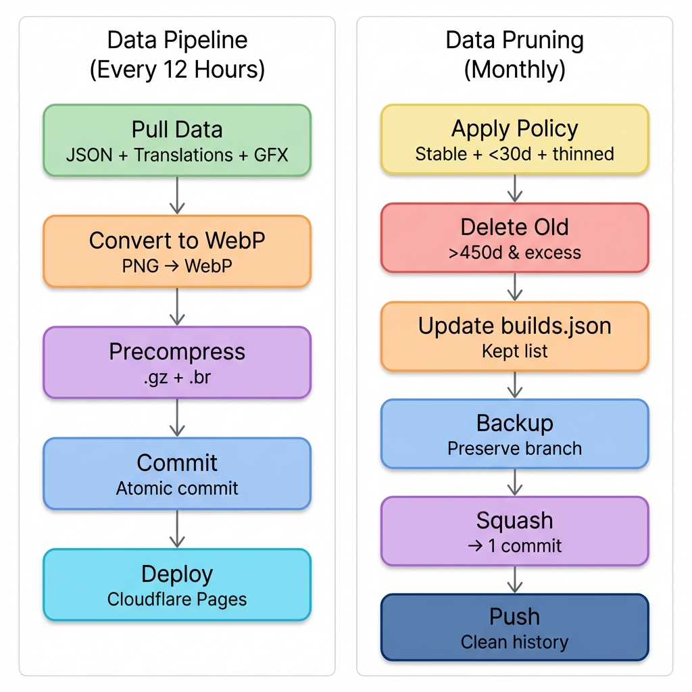

# cbn-data

Game data from [Cataclysm: Bright Nights](https://github.com/cataclysmbn/Cataclysm-BN) updated every 12 hours and deployed at [cbn-data.pages.dev](https://cbn-data.pages.dev/).

[](https://github.com/ushkinaz/cbn-data/actions/workflows/pull-data.yml)
[](https://github.com/ushkinaz/cbn-data/actions/workflows/prune-data.yml)

### Workflows



## Usage

### Get available versions

```
https://cbn-data.pages.dev/builds.json
```

### Get game data

```
https://cbn-data.pages.dev/data/2024-01-10/all.json
https://cbn-data.pages.dev/data/2024-01-10/all_mods.json
```

**Structure:**
```json
{
  "build_number": "2024-01-10",
  "release": { /* GitHub release data */ },
  "data": [ /* game objects with __filename field */ ]
}
```

### Get translations

```
https://cbn-data.pages.dev/data/2024-01-10/lang/fr.json
https://cbn-data.pages.dev/data/2024-01-10/lang/zh_CN_pinyin.json
```

Format: [Jed-compatible](https://www.npmjs.com/package/po2json), produced with po2json.

### Get tileset graphics

```
https://cbn-data.pages.dev/data/2024-01-10/gfx/UltimateCataclysm/...
```

All graphics are WebP format. Original PNGs converted during build.

## Performance

All JSON files have precompressed `.gz` and `.br` variants. Cloudflare Pages automatically serves the best compression based on client support:
- Brotli-capable clients → `.br` (~90% smaller)
- Gzip-capable clients → `.gz` (~85% smaller)
- Legacy clients → original JSON

## Repository Structure

- `action` branch: CI workflows and scripts
- `main` branch: Published data (deployed)
- `dev` branch: Development data (sometimes)

## Local Development

```bash
# Clone action branch only
git clone --single-branch https://github.com/ushkinaz/cbn-data

# Install dependencies
yarn install --frozen-lockfile --ignore-engines

# Run data pull (dry-run by default)
node pull-data-launcher.js

# Run with actual writes
GITHUB_TOKEN=xxx node pull-data-launcher.js
```

## Data Retention

Monthly pruning keeps:
- All stable releases
- All builds from last 30 days
- Older builds on thinning schedule (every 2/4/8 days)
- Drops builds older than 450 days

## Contributing

Built for [The Hitchhiker's Guide to Cataclysm: Bright Nights](https://cbn-guide.pages.dev/).

Contributions welcome! See [AGENTS.md](AGENTS.md) for architecture details.
